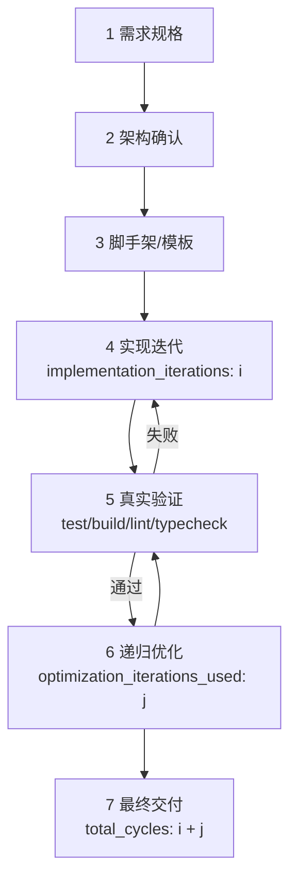
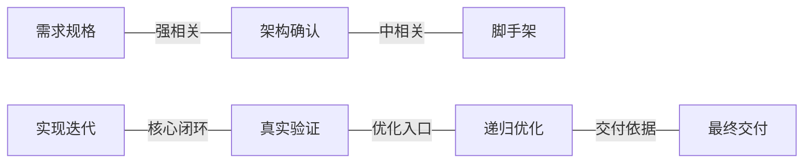
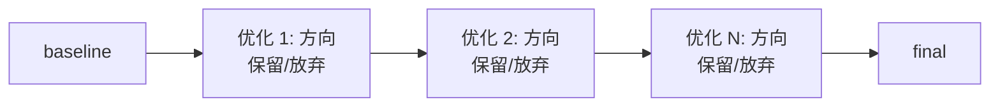

# 进度可视化

用于 `medium` / `large` 任务、用户询问状态、需要 Mermaid 输出或最终交付进度图时。

## 进度记录

维护轻量进度记录，让用户知道当前阶段、循环次数、验证状态和优化方向。

进入新阶段时输出：

```text
当前阶段：第 X/14 步 - 阶段名称
当前目标：
下一步动作：
```

每轮实现迭代后记录：

```text
实现迭代：第 i/max_iterations 轮
本轮目标：
修改方向：
关键修改：
运行的验证：
结果：
下一步：
```

每轮递归优化后记录：

```text
优化迭代：第 j/optimization_iterations 轮
优化方向：
优化前 baseline：
优化后结果：
运行的验证：
是否保留：
保留或放弃原因：
```

分别统计三类计数：

- `implementation_iterations`：实现/修复循环次数。
- `optimization_iterations_used`：递归优化循环次数。
- `total_cycles`：实现迭代次数 + 优化迭代次数。

不要等到最终交付再倒推进度。长任务中，每完成一个阶段或一轮迭代都给用户简短更新。

## Mermaid 进度图

长任务和最终交付应包含 Mermaid 图。`small` 任务可用纯文本，除非用户要求 Mermaid。

图中必须展示：

- 功能节点：需求、架构、脚手架、实现、测试、优化、交付。
- 当前阶段或最终停止节点。
- 实现迭代次数。
- 递归优化方向和轮次。
- 验证状态：真实测试、沙箱验证或未验证。
- 提前停止时的停止原因。

## 流程总览模板



## 功能节点关系图

当任务涉及多个功能节点、module 或优化方向时，除了流程图，还应提供功能节点关系图。



## 优化关系图模板



如果当前输出环境不适合 Mermaid，提供等价的纯文本树，但不要省略计数和优化方向。
